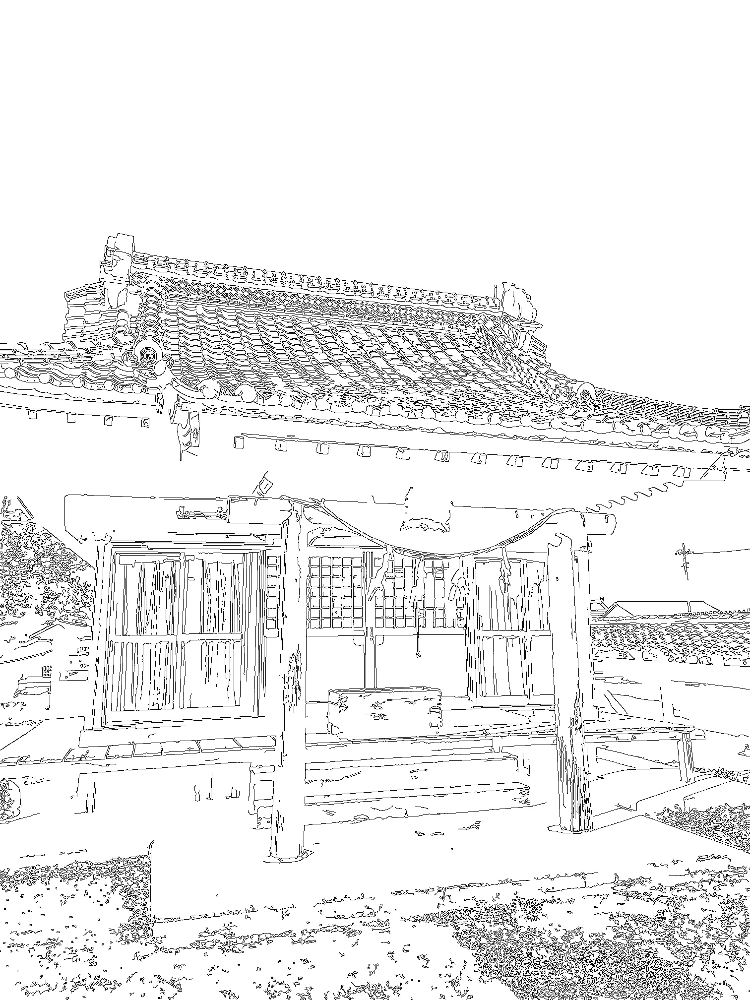

# Contour detection

Note: This tool is still under development.

## Description

This tool extracts contour from image and output the result.

## CLI

~~~sh
go install github.com/egawata/contour
contour -i input.jpg -o output.png
~~~

- `-i`: input image
- `-o`: output image
- `-t1` `-t2`: threshold. Default = `t1: 100` `t2: 200`

## Web Application

### Run with Docker

~~~sh
docker build -t github.com/egawata/contour .
docker run -p 8080:8080 github.com/egawata/contour
~~~

Then open `http://localhost:8080` on your browser.

### Build from source

To build from source, Go, npm and [OpenCV](https://opencv.org/) library is required.
After prepared, run the following.

~~~sh
script/build.sh
~~~

Then, run the app and open `http://localhost:8080` from your browser.

~~~sh
cd backend
./app
~~~

## Sample

~~~
contour -i sample/input.jpg -o sample/output.jpg -t1 50 -t2 150
~~~

## License

Licensed under the Apache 2.0 license. Copyright (c) 2024 by egawata
