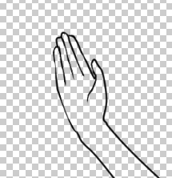

# Clip Studio Paint での利用例

## 元画像を準備

3Dモデリングツールで作ったものや写真など、最終的に画像に出力できるものであればなんでもOKです。
(自分に著作権または利用許諾のある画像のみ使いましょう😇)

Clip Studio Paint の 3D モデルを使用する場合、オブジェクトの `サブツール詳細` > `環境` > `レンダリング設定` を以下のようにしておくと期待通りの輪郭を抽出しやすいです。

- `輪郭線`
    - `輪郭線を付ける` > OFF
    - `テクスチャを使用する` > OFF
- `照明`
    - `このモデルに影を落とす` > OFF

この画像を `画像を統合して書き出し` で書き出します。`png` 形式が良いと思います。

## contour ツールで輪郭抽出

`contour` を起動し、用意した画像を読み込んで変換します。

`Threshold1` `Threshold2` は輪郭の検出のしやすさを調整します。元画像の輪郭がはっきりしない場合は左寄りに、わりとはっきりしている場合は右寄りにするとよさそうです。

微調整 → `Convert` を繰り返して調整してみてください。最適な輪郭を抽出できたら `Download Result` を押して結果をファイルに書き出します。

## Clip Studio Paint で細かい修正

Clip Studio Paint で画像を読み込みます。

この時点では以下のような問題がありそうです。

- 線がギザギザ
- 白黒画像だが、線画として使いたいので白地の部分を透明にしたい
- 線が乱れているところがある

### ベクターレイヤーに変換

輪郭線のレイヤーを一旦ベクターレイヤーに変換します。設定はデフォルト通りで問題ないと思います。

この時点で白地が透明になり、線もなめらかになっていると思います。
必要に応じて線の太さを変えたりしてある程度編集します。

### ラスタレイヤーに再変換して微調整

このあとラスタレイヤーに再変換して、ベクターでは修正しづらい部分を手作業で修正します。

### 完成

完成したら色を自由に塗っていきます。

服は着ましょうね。

